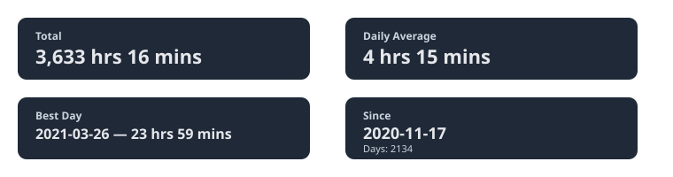
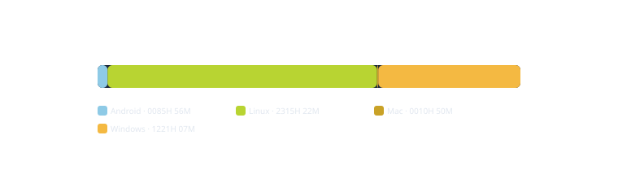
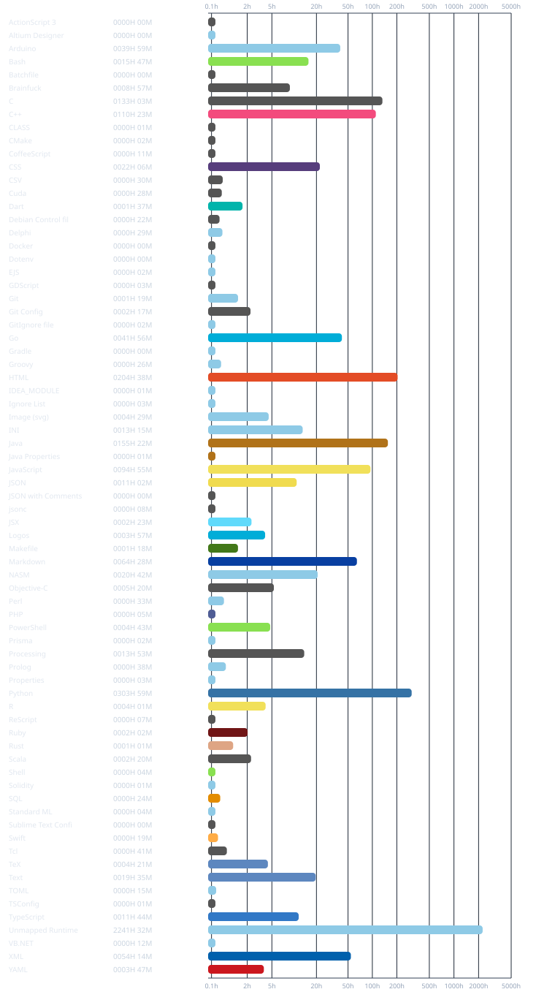
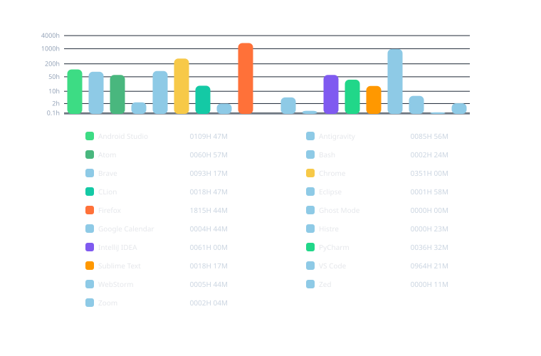
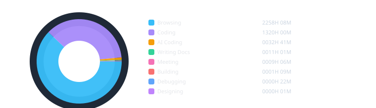

## Systems Engineer.

> There are two versions of my work.
> One is documented, tested, and built to last.
> The other is functional.
> Which one you receive depends entirely on you.

<!-- WAKATIME:START -->

### Summary

### Operating Systems

### Languages

### Editors

### Categories

<!-- WAKATIME:END -->

Email: mahadi.s.neloy@gmail.com

_Problems get solved, or I find somewhere that lets me solve them._
